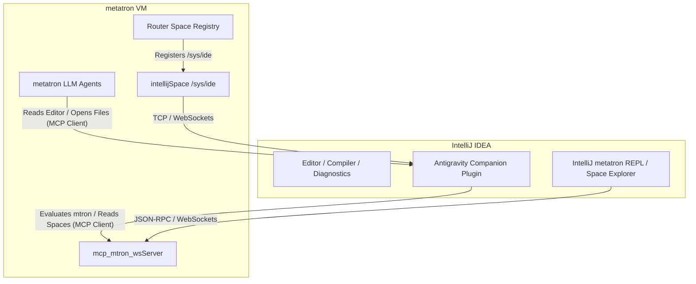

# Metatron $\leftrightarrow$ IntelliJ Integration Design

Tighter integration between the **metatron** agent runtime and **IntelliJ IDEA** enables more autonomous developer loops, real-time code inspection, and a seamless developer experience. Below are three proposed integration patterns, ranging from configuration-driven MCP linking to a native metatron Space implementation.

---

## Architecture Overview



---

## Integration Options

### Option 1: Bidirectional MCP Linkage (Configuration & Wire-up)
This option uses existing protocols on both sides to wire the systems together.

*   **IntelliJ $\rightarrow$ metatron:**
    IntelliJ connects to metatron's `mcp_mtron_wsHandler` WebSocket endpoint (defaulting to `ws://localhost:8555/mcp`).
    *   This gives the IDE's AI assistant or any tool client inside IntelliJ access to metatron's `eval_mtron`, `list_space`, and `router_info` tools.
*   **metatron $\rightarrow$ IntelliJ:**
    Metatron agents are configured to connect to the IntelliJ companion's TCP port (`39079` or `64342`) as an `mcp_client` in `agent.mtron`.
    *   This gives metatron agents access to IDE-specific tools like `ide_get_active_editor`, `ide_open_file`, and `ide_get_diagnostics`.

---

### Option 2: The `intellijSpace` (Virtual URI Space)
This option brings the IDE control layer directly into the core `mtron` syntax by implementing a virtual Space (registered under `/sys/ide/` or `/sys/intellij/`) that communicates with the IntelliJ companion.

Following metatron's data-oriented design, any read/write on the `/sys/ide/` URI namespace is mapped to IntelliJ actions:

*   **Reading `*/sys/ide/active_editor/content`:**
    Calls the IntelliJ companion's `ide_get_active_editor` under the hood and returns the file content as a `str::T` or `markdown::T`.
*   **Writing a file path/position to `*/sys/ide/open_files`:**
    Triggers an IDE call to open that file at the specified line.
*   **Reading `*/sys/ide/diagnostics/`:**
    Retrieves real-time compiler warnings/errors directly from IntelliJ's compilation cache.

#### URI Endpoints & Data Model

| URI Endpoint | Read (`*`) Result | Write (`->`) Input & Behavior | Description |
| :--- | :--- | :--- | :--- |
| `</sys/ide/status>` | **`Rec`**: connection metadata e.g. `[connected => T, port => 39079, ide => "IntelliJ IDEA"]` | *N/A (Read-only)* | Live status of the IDE connection. |
| `</sys/ide/active_editor/path>` | **`Uri`**: absolute file URI of the focused document | **`Uri`** or **`Str`**: Opens the specified file path in the IDE. | The filepath of the active editor. |
| `</sys/ide/active_editor/content>` | **`Str`**: full textual content of the active file | **`Str`**: Overwrites/updates the entire file content. | Complete editor source code. |
| `</sys/ide/active_editor/selection>` | **`Str`** (selected text) or **`NoObj`** (if no selection) | **`Str`**: Replaces the selected text region. | Text selection highlighted in the IDE. |
| `</sys/ide/active_editor/cursor>` | **`Int`**: 0-indexed character offset from file start | **`Int`**: Moves the text cursor to the character offset. | Current cursor position. |
| `</sys/ide/open_files/>` *(Branch)* | **`Relation (Uri => Rec)`**: stream of open files mapped to their editor states | **`Uri`**, **`Str`**, or **`Lst`**: Opens all specified paths. | Open document tabs in IntelliJ. |
| `</sys/ide/diagnostics>` | **`Lst (Rec)`**: compilation warnings and inspection issues | *N/A (or triggers full project rebuild)* | Live compiler and inspection problems. |

#### Usage Examples in mtron:

##### 1. Read open editor and search for FIXME:
```mtron
*</sys/ide/active_editor/content>.split("\n").filter(contains("FIXME"))
```

##### 2. Inline Code Refactoring Loop (Agent Pattern):
An LLM agent can read the highlighted code selection, optimize/fix it, and replace it inline:
```mtron
# 1. Grab the selection
selected_code = *</sys/ide/active_editor/selection>;

# 2. (LLM agent processes and optimizes selection_code -> returns optimized_code)
optimized_code = ...;

# 3. Write it back, replacing the highlighted text in IntelliJ
optimized_code -> </sys/ide/active_editor/selection>
```

##### 3. Diagnostics Inspector:
List files with compilation errors and open the first one in the editor:
```mtron
# Filter files in the project with errors
errors = *</sys/ide/diagnostics>.filter(x => x/severity == 'error');

# Open the first error's file at the specific line:
first_err = errors.take(1);
[path => first_err/path, line => first_err/line] -> </sys/ide/active_editor/path>
```


---

### Option 3: IntelliJ metatron REPL & Space Explorer Plugin
A dedicated IntelliJ Plugin (written in Kotlin/Java) that embeds metatron UI elements directly into the IDE:

1.  **Space Explorer Tool Window:**
    Renders a live tree component representing `Router.global()`. Users can expand nodes (e.g. `/sys`, `/usr`, `/m`) to inspect active spaces, registered variables, and JVM instruction sets.
2.  **Interactive REPL:**
    An interactive terminal window that runs `mtron` expressions against the active VM process.
3.  **Inline Code Execution:**
    Allows developers to highlight `mtron` code in `.mtron` files, right-click, and select "Run in metatron VM" (similar to a database console).

---

> [!NOTE]
> **Option 2 (Virtual URI Space)** is highly aligned with metatron's core philosophy—treating the external IDE as just another registerable data space. 

> [!IMPORTANT]
> To implement Option 2, we would define a new `studio.phaseshift.metatron.isa.web.space.intellijSpace` (or `ideSpace`) extending `AbstractSpace` and register it inside `webInstSet` or `machInstSet`.
